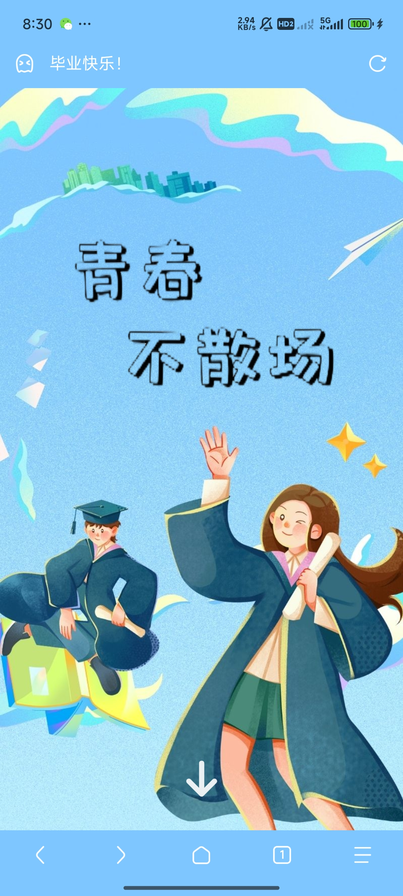
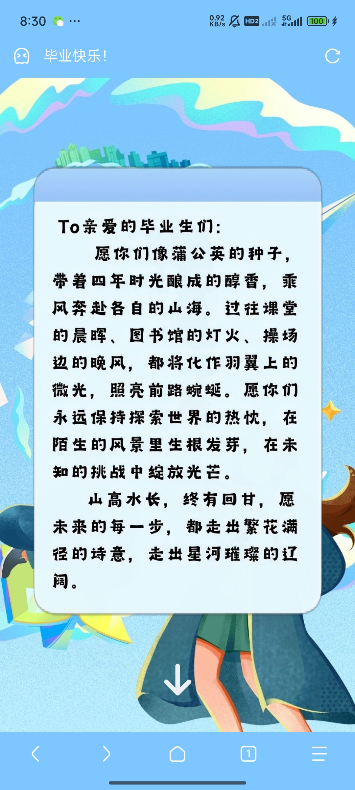

# 🎇 DanmuShow 弹幕展示系统

这是一个基于 **Vue3 + Flask + SQLite** 开发的弹幕展示系统，支持弹幕的发送、展示、点击互动。

## 📌 功能简介

### 前端部分（Vue3）

- 弹幕自动循环展示
- 支持用户自定义输入弹幕
- 点击弹幕可触发礼花动画
- 动态样式与轨迹生成
- 与后端进行实时交互（获取与提交）

### 后端部分（Flask）

- 弹幕数据接口（GET 获取、POST 添加、DELETE 删除）
- 使用 SQLite 作为数据库
- 支持跨域访问（通过 CORS）
- 通过 Nginx 反向代理部署，支持 API 前缀 `/graduation2025/api/`

## 🚀 项目结构

```
project-root/
│
├── frontend/           # 前端项目目录（Vue3）
│   ├── App.vue
│   ├── main.js
│   └── ...
│
├── backend/            # 后端项目目录（Flask）
│   ├── app.py          # 主 Flask 程序
│   └── danmu.db        # SQLite 数据库
│
├── nginx.conf          # 推荐的 Nginx 配置
└── README.md           # 项目说明
```

## 🔧 安装与运行

### 后端（Flask）

```
cd backend
pip install flask flask_sqlalchemy flask_cors
python app.py
```

### 前端（Vue3）

```
cd frontend
npm install
npm run dev
```

### Nginx 配置示例

```
location /graduation2025/api/ {
    proxy_pass http://127.0.0.1:5000/;
    proxy_set_header Host $host;
    proxy_set_header X-Real-IP $remote_addr;
    proxy_set_header X-Forwarded-For $proxy_add_x_forwarded_for;
    proxy_set_header X-Forwarded-Proto $scheme;
    proxy_redirect off;
}
```

## 🧩 接口说明

因为 ``nginx`` 默认转发采取的是 ``GET`` 方法，我并未找到可用的解决方法，所以全都使用了 ``GET`` 方法。

### 获取所有弹幕

```
GET /graduation2025/api/danmus
```

返回格式：

```
{
  "list": [
    {"id": 1, "text": "hello"},
    {"id": 2, "text": "world"}
  ]
}
```

### 添加弹幕

```
GET /graduation2025/api/danmus
```

请求体：

```
{
  "text": "这是一条弹幕"
}
```

返回：

```
{"status": "success"}
```

### 删除弹幕

```
GET /graduation2025/api/danmus/<id>
```

## 📱页面展示






## 📄 License

本项目使用 MIT 许可证，欢迎自由使用与修改。